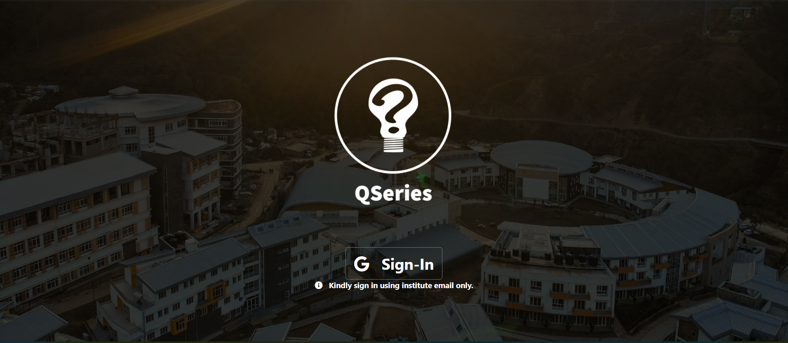

# Q-Series



#### An Open Source Quiz conducting platform

Table of Contents

* [About](#about)
  * [Tech Stack](#tech-stack)
  * [Tools and Services](#tools-and-services-used)
* [Getting Started](#getting-started)
  * [Prerequisites](#prerequisites)
  * [Installation](#installation)
* [Usage](#usage)
* [Contribute](#contribute)
* [Contact](#contact)

---

### About

QSeries is a web application which can be used to conduct MCQ (multiple choice questions) quizes. With the entirety of education and exams dependent on online tools, this application is here to give test host and test takers a personalized feel. The application is responsive and hence works well with mobile and desktop devices alike.

#### **Tech Stack:**

* NodeJS
* Bootstrap
* JQuery
* MongoDB

#### **Tools and Services Used:**

* Git/Github
* Google Developer Console
* Heroku
* MongoDB Atlas
* Robo 3T

---

### Getting Started

If you want to host a test on QSeries the following steps can be followed to get started

#### **Prerequisites**

1. MongoDB installed.
2. NodeJS installed.
3. Google account

#### **Installation**

1. Fork the repo and clone it to your local machine.

> git clone https://github.com/**you**/Q-Series.git

2. Run the following command to install all the dependencies

> npm install

3. Login to the google developer console and create a new project with name Q Series
4. Create a new OAuth 2.0 client id inside the project Q Series and name it Q-Series. Then set the following properties

   1. Authorized JavaScript Origins : `http://localhost:3000`
   2. Authorzed Redirect URIs : `http://localhost/auth/google/QSeries`
   3. Then save. This will create a `client_id` and `client_secret`. Download the json file containing them.
5. Inside the OAuth consent screen tab, insert the `domain-name`, `app-name` and `developer-contact`. Set the app as internal/external as per your choice and chose the following scopes:

   1. `.../auth/userinfo.email`
   2. `.../auth/userinfo.profile`
   3. `openid`
6. Inside the root folder create a new file with the name `.env` and insert the following key value pairs.

   > SECRET=abrakadabra
   > PASS= MongoDB Atlas connection string
   > CLIENT_ID=OAuth client_id downloaded from Google Developer Console
   > CLIENT_SECRET=OAuth client_secret downloaded from Google Developer Console
   >

   This completes the installation. Use the following command to run the app on localhost:3000

   > nodemon app.js
   >

---

### Usage

1. To use the application as a host, make the following changes inside `app.js` for the GET route "/account":

```
        if(req.user.email === "email_id_of_the_host"){
          res.render("admin", {name:studentName, user:req.user, event:found});
        }  
	else{  
		res.render("account", {name:studentName, user:req.user, event:found});
	}
```

2. Type in the following command in the terminal to start the database server.

   > mongod
   >
3. When you login with the host's gmail-ID, you will be taken to the admin page. The administrator has the following functionalities in control:

   1. Add a new Quiz.
   2. Add and delete questions corresponding to a Quiz.
   3. Modify the particulars of a Quiz.
   4. View an existing Quiz.
   5. Delete a Quiz.
4. A test taker has the following functionalities in control:

   1. Login with any Gmail-ID.
   2. Regsiter for a Quiz.
   3. Attempt a quiz at the scheduled time.
   4. View his/her score for an attemted quiz.

---

### Contribute

This is an ongoing project. Any contribution, big or small is appreciated. Follow the below steps to start contributing:

1. Fork the project
2. Create your own feature branch `(git checkout -b myFeature)`
3. Commit your changes (`git commit -m 'Added a feature'`)
4. Push to remote (`git push origin myFeature`)
5. Open a pull request.

### Contact

Piyush Verma - [LinkedIn](https://www.linkedin.com/in/piyush-verma-4a7846122/) - [email](piyushverma476@gmail.com)

Project-link - [Pepinni/Q-Series: It is a test conducting application (github.com)](https://github.com/Pepinni/Q-Series)
